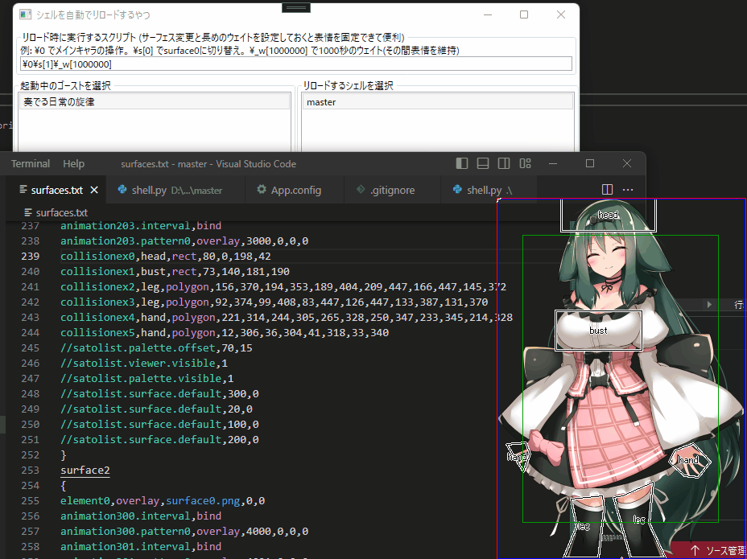

# ShellHotReload
起動中のゴーストのシェルに変更が入ると、自動的にゴーストのシェルをリロードします。  
surfaces.txt や png画像ファイルに変更が入ると自動的にゴーストの立ち絵が更新されるため、シェルをつくるときに便利かもしれません。

## つかいかた
* SSPでゴーストを起動します。
* このアプリ(ShellHotReload.exe)を起動します。
* 起動中のゴーストがリストアップされるので、左のリストからゴーストを、右のリストからシェルを選択します。
* アプリの起動中、選択したシェルのファイルに変更があると、自動的にゴーストのシェルをリロードします。
* 確認したいサーフェスがあれば「リロード中に実行するスクリプト」に任意のサーフェスに切り替えるスクリプトを入力することで、リロード時に指定のサーフェスを表示するようにできます。

